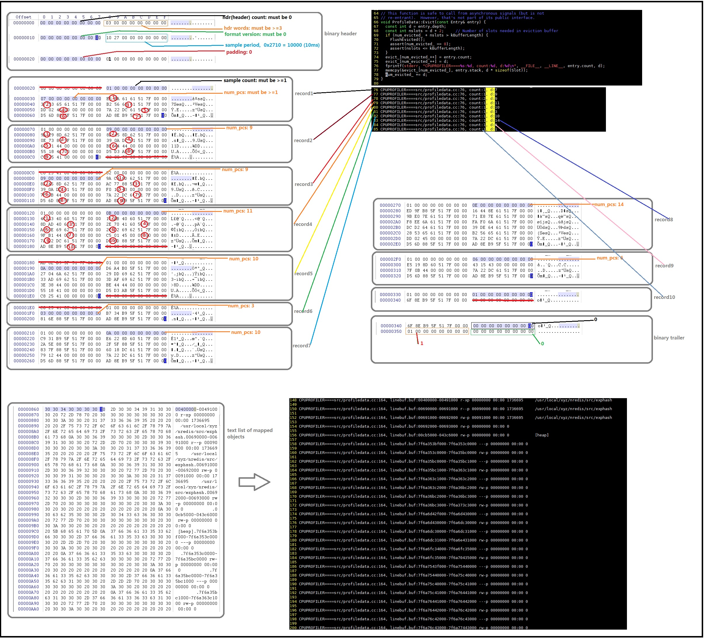

# 0.cpu profile format



# 1.[EntryPoint](./src/profiler.cc)

* user define signal [CPUPROFILESIGNAL](./src/profiler.cc#L202TL206)

* its callback function is [CpuProfilerSwitch](./src/profiler.cc#L145)
    * call ProfilerStart\(\): call CpuProfiler::Start\(\)
    * call ProfilerStop\(\): call CpuProfiler::Stop\(\)

# 2.[CpuProfiler](./src/profiler.cc)

* only define&implement class CpuProfiler in the cpp file\-\- ./src/profiler.cc

* important members:
    * ProfileData   collector_;
    * ProfileHandlerToken\* prof_handler_token_;

* important funcs:
    * Start\(\): call ProfileData::Start\(\)
    * Stop\(\): call ProfileData::Stop\(\)
    * FlushTable\(\): call ProfileData::FlushTable\(\)
    * EnableHandler\(\): call ProfileHandlerRegisterCallback\(prof_handler, this\);
        * [prof_handler](./src/profiler.cc#L336TL377):
            * call [GetPC\(\)](./src/getpc.h#L138TL156): get the instruction that was beging executed 
            * call [GetStackTraceWithContext\(\)](./src/stacktrace.cc#L298)
            * call ProfileData::Add\(\)


# 3.[ProfileData](./src/profiledata.cc)


# 4.[pprof](./src/pprof)

* a perl script file

* [ReadCPUProfile](./src/pprof#L3964)

* [subtract address](./src/pprof#L4014TL4021)
```
      printf("pc:%016x\n", $pc);
      # Subtract one from caller pc so we map back to call instr.
      # However, don't do this if we're reading a symbolized profile
      # file, in which case the subtract-one was done when the file
      # was written.
      if ($j > 0 && !$main::use_symbolized_profile) {
        $pc--;
      }
```

* [ParseLibraries](./src/pprof#L4506)


